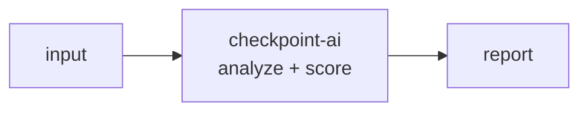

<a name="top"></a>
<div align="center">


# CHECKPOINT-AI

### NIST AI RMF / EU AI Act / ISO 42001 self-assessment & SSP generator


[](https://pypi.org/project/cognis-checkpoint-ai/) [](https://github.com/cognis-digital/checkpoint-ai/actions) [](LICENSE) [](https://github.com/cognis-digital)

*Federal / Compliance — NIST, CMMC, FedRAMP, and SBIR/GSA workflows.*

</div>

```bash
pip install cognis-checkpoint-ai
checkpoint-ai scan .            # → prioritized findings in seconds
```


<!-- cognis:example:start -->
## 🔎 Example output

Real, reproducible output from the tool — runs offline:

```console
$ checkpoint-ai-emit --version
CHECKPOINT-AI 0.1.0
```

```console
$ checkpoint-ai-emit --help
usage: checkpoint-ai [-h] [--version] [--format {table,json,sarif,csv}]
                     {catalog,assess,ssp} ...

CHECKPOINT-AI: NIST AI RMF / EU AI Act / ISO 42001 self-assessment & SSP
generator.

positional arguments:
  {catalog,assess,ssp}
    catalog             list the cross-walked control catalog
    assess              score a self-assessment JSON file
    ssp                 generate an OSCAL-flavored SSP from an assessment

options:
  -h, --help            show this help message and exit
  --version             show program's version number and exit
  --format {table,json,sarif,csv}
                        output format (sarif/csv apply to the 'assess'
                        command)
```

```console
$ checkpoint-ai-emit catalog
CHECKPOINT-AI control catalog (12 controls)
  GOV-1  (w5) GOVERN   AI governance policy & accountability owner
         nist_ai_rmf=GOVERN 1.1 eu_ai_act=Art.17 iso_42001=5.2
  GOV-2  (w4) GOVERN   Risk tolerance & escalation thresholds defined
         nist_ai_rmf=GOVERN 1.3 eu_ai_act=Art.9 iso_42001=6.1
  GOV-3  (w3) GOVERN   Workforce AI competency & training
         nist_ai_rmf=GOVERN 2.2 eu_ai_act=Art.4 iso_42001=7.2
  MAP-1  (w4) MAP      Intended purpose & context of use documented
         nist_ai_rmf=MAP 1.1 eu_ai_act=Art.11 iso_42001=8.1
  MAP-2  (w4) MAP      Foreseeable misuse & impacted populations identified
         nist_ai_rmf=MAP 3.1 eu_ai_act=Art.9 iso_42001=6.1.2
  MAP-3  (w5) MAP      Data provenance & lawful basis recorded
         nist_ai_rmf=MAP 2.3 eu_ai_act=Art.10 iso_42001=7.4
  MEA-1  (w4) MEASURE  Performance & accuracy metrics evaluated
         nist_ai_rmf=MEASURE 2.3 eu_ai_act=Art.15 iso_42001=9.1
  MEA-2  (w5) MEASURE  Bias / fairness testing across subgroups
         nist_ai_rmf=MEASURE 2.11 eu_ai_act=Art.10 iso_42001=9.1
  MEA-3  (w4) MEASURE  Adversarial robustness & security testing
         nist_ai_rmf=MEASURE 2.7 eu_ai_act=Art.15 iso_42001=8.3
  MAN-1  (w5) MANAGE   Human oversight & intervention controls
         nist_ai_rmf=MANAGE 1.1 eu_ai_act=Art.14 iso_42001=8.4
  MAN-2  (w4) MANAGE   Incident response & post-market monitoring
         nist_ai_rmf=MANAGE 4.1 eu_ai_act=Art.72 iso_42001=10.1
  MAN-3  (w4) MANAGE   Logging & traceability of system decisions
         nist_ai_rmf=MANAGE 2.2 eu_ai_act=Art.12 iso_42001=8.5
```

> Blocks above are real `checkpoint-ai` output — reproduce them from a clone.

<!-- cognis:example:end -->

## Usage — step by step

`checkpoint-ai` runs an AI-governance self-assessment cross-walked across NIST AI RMF, the EU AI Act, and ISO 42001, and can emit an OSCAL-flavored SSP.

1. **Install**:
   ```bash
   pip install -e .
   ```
2. **List the cross-walked control catalog**:
   ```bash
   checkpoint-ai catalog
   ```
3. **Score a self-assessment** JSON file:
   ```bash
   checkpoint-ai assess assessment.json
   ```
4. **Generate an SSP** (OSCAL-flavored System Security Plan) from the same assessment:
   ```bash
   checkpoint-ai ssp assessment.json > ssp.json
   ```
5. **Export findings** in the format your dashboard speaks. Each open control gap
   is a finding; `assess` can emit it as a table, JSON, **SARIF 2.1.0**, or **CSV**:
   ```bash
   checkpoint-ai --format sarif assess assessment.json > checkpoint.sarif.json   # code-scanning dashboards
   checkpoint-ai --format csv   assess assessment.json > gaps.csv                 # spreadsheets / GRC trackers
   ```
   The SARIF log carries one rule per control and one result per gap, each tagged
   with a `security-severity` and the NIST AI RMF / EU AI Act / ISO 42001 crosswalk.
6. **Automate in CI** — gate the build and publish findings on each governance change:
   ```bash
   checkpoint-ai assess assessment.json   # non-zero exit on an unaddressed weight-5 gap
   checkpoint-ai --format sarif assess assessment.json > checkpoint.sarif.json   # upload to code scanning
   ```

## Demos — real-world scenarios

Each folder under [`demos/`](demos/) is a self-contained scenario: a realistic
assessment file in the tool's input format plus a `SCENARIO.md` describing where
the data came from, what to expect, the exact run command, and how to act.

| Demo | Scenario | EU tier | Outcome |
|------|----------|---------|---------|
| [`01-pre-launch-gap-analysis`](demos/01-pre-launch-gap-analysis/) | Support copilot six weeks from launch | limited | weight-5 gaps → CI fails |
| [`02-iso-42001-readiness`](demos/02-iso-42001-readiness/) | AIMS one control from a stage-1 audit | limited | single open gap |
| [`03-eu-ai-act-high-risk`](demos/03-eu-ai-act-high-risk/) | Hiring system conformity prep (Annex III) | high | bias-testing gap blocks CE mark |
| [`04-prohibited-practice-stop`](demos/04-prohibited-practice-stop/) | Citizen social-scoring proposal | unacceptable | perfect posture, still a hard stop |
| [`05-medical-device-high-risk`](demos/05-medical-device-high-risk/) | Retinal-screening triage that passes | high | clean — the target state |
| [`06-internal-analytics-minimal`](demos/06-internal-analytics-minimal/) | Internal anomaly flagger | minimal | gaps, but exit 0 (right-sized) |
| [`07-greenfield-baseline`](demos/07-greenfield-baseline/) | Day-zero assessment, nothing built | limited | 0/100, full POA&M backlog |
| [`08-na-scoping`](demos/08-na-scoping/) | OCR digitizer scoping controls out | minimal | `not_applicable` handling |
| [`09-ci-sarif-gate`](demos/09-ci-sarif-gate/) | Credit adjudicator wired into CI | high | exit-code gate + SARIF upload |
| [`10-vendor-model-intake`](demos/10-vendor-model-intake/) | Third-party SaaS due diligence | limited | gaps → vendor questionnaire |

```bash
checkpoint-ai assess demos/09-ci-sarif-gate/self-assessment.json
checkpoint-ai --format sarif assess demos/09-ci-sarif-gate/self-assessment.json > checkpoint.sarif.json
```

## Contents

- [Why checkpoint-ai?](#why) · [Features](#features) · [Quick start](#quick-start) · [Example](#example) · [Architecture](#architecture) · [AI stack](#ai-stack) · [How it compares](#how-it-compares) · [Integrations](#integrations) · [Install anywhere](#install-anywhere) · [Related](#related) · [Contributing](#contributing)

<a name="why"></a>
## Why checkpoint-ai?

NIST AI RMF / EU AI Act / ISO 42001 self-assessment & SSP generator — without standing up heavyweight infrastructure.

`checkpoint-ai` is single-purpose, scriptable, and self-hostable: point it at a target, get prioritized results in the format your workflow already speaks (table · JSON · SARIF), gate CI on it, and let agents drive it over MCP.

<div align="right"><a href="#top">↑ back to top</a></div>

<a name="features"></a>
## Features

- ✅ Cross-walked control catalog: NIST AI RMF · EU AI Act · ISO/IEC 42001
- ✅ Weighted posture scoring, maturity bands, and per-function breakdown
- ✅ EU AI Act risk-tier classification (minimal / limited / high / unacceptable)
- ✅ Gap analysis with prioritized remediation (OSCAL-flavored SSP + POA&M)
- ✅ Export findings as **table · JSON · SARIF 2.1.0 · CSV**
- ✅ CI gate: non-zero exit on an unaddressed high-weight gap
- ✅ 10 real-world demo scenarios in [`demos/`](demos/)
- ✅ Runs on Linux/macOS/Windows · Docker · devcontainer
- ✅ Ports in Python, JavaScript, Go, and Rust (`ports/`)

<div align="right"><a href="#top">↑ back to top</a></div>

<a name="quick-start"></a>
## Quick start

```bash
pip install cognis-checkpoint-ai
checkpoint-ai --version
checkpoint-ai catalog                                            # list the cross-walked controls
checkpoint-ai assess assessment.json                             # score; non-zero exit on a high-weight gap
checkpoint-ai --format json  assess assessment.json              # machine-readable
checkpoint-ai --format sarif assess assessment.json              # SARIF 2.1.0 for code-scanning
checkpoint-ai ssp assessment.json > ssp.json                     # OSCAL-flavored SSP + POA&M
```

<div align="right"><a href="#top">↑ back to top</a></div>

<a name="example"></a>
## Example

```text
$ checkpoint-ai assess demos/03-eu-ai-act-high-risk/self-assessment.json
CHECKPOINT-AI assessment: sentinel-resume-screener
  owner            : People Operations, Responsible AI Office
  EU AI Act tier   : high
  overall posture  : 72.8/100 (Defined)
  function scores  :
    GOVERN   : 91.2/100
    MANAGE   : 74.2/100
    MAP      : 76.2/100
    MEASURE  : 51.2/100
  framework cover  :
    nist_ai_rmf : 66.7%
    eu_ai_act   : 66.7%
    iso_42001   : 66.7%
  ...
  open gaps        : MAP-3, MEA-2, MEA-3, MAN-2
$ echo $?
2   # weight-5 gaps (MAP-3, MEA-2) remain — CI gate fails
```

<div align="right"><a href="#top">↑ back to top</a></div>

<a name="architecture"></a>
## Architecture



<div align="right"><a href="#top">↑ back to top</a></div>

<a name="ai-stack"></a>
## Use it from any AI stack

`checkpoint-ai` is interoperable with every popular way of using AI:

- **MCP server** — `checkpoint-ai mcp` (Claude Desktop, Cursor, Cognis.Studio, [uncensored-fleet](https://github.com/cognis-digital/uncensored-fleet))
- **OpenAI-compatible / JSON** — pipe `checkpoint-ai scan . --format json` into any agent or LLM
- **LangChain · CrewAI · AutoGen · LlamaIndex** — wrap the CLI/JSON as a tool in one line
- **CI / scripts** — exit codes + SARIF for non-AI pipelines

<div align="right"><a href="#top">↑ back to top</a></div>

<a name="how-it-compares"></a>
## How it compares

| | **Cognis checkpoint-ai** | usnistgov |
|---|:---:|:---:|
| Self-hostable, no account | ✅ | varies |
| Single command, zero config | ✅ | ⚠️ |
| JSON + SARIF for CI | ✅ | varies |
| MCP-native (AI agents) | ✅ | ❌ |
| Polyglot ports (JS/Go/Rust) | ✅ | ❌ |
| Open license | ✅ COCL | varies |

*Built in the spirit of **usnistgov/OSCAL**, re-framed the Cognis way. Missing a credit? Open a PR.*

<div align="right"><a href="#top">↑ back to top</a></div>

<a name="integrations"></a>
## Integrations

Pipes into your stack: **SARIF** for code-scanning, **JSON** for anything, an **MCP server** (`checkpoint-ai mcp`) for AI agents, and a webhook forwarder for SIEM/Slack/Jira. See [`docs/INTEGRATIONS.md`](docs/INTEGRATIONS.md).

<div align="right"><a href="#top">↑ back to top</a></div>

<a name="install-anywhere"></a>
## Install — every way, every platform

```bash
pip install "git+https://github.com/cognis-digital/checkpoint-ai.git"    # pip (works today)
pipx install "git+https://github.com/cognis-digital/checkpoint-ai.git"   # isolated CLI
uv tool install "git+https://github.com/cognis-digital/checkpoint-ai.git" # uv
pip install cognis-checkpoint-ai                                          # PyPI (when published)
docker run --rm ghcr.io/cognis-digital/checkpoint-ai:latest --help        # Docker
brew install cognis-digital/tap/checkpoint-ai                             # Homebrew tap
curl -fsSL https://raw.githubusercontent.com/cognis-digital/checkpoint-ai/main/install.sh | sh
```

| Linux | macOS | Windows | Docker | Cloud |
|---|---|---|---|---|
| `scripts/setup-linux.sh` | `scripts/setup-macos.sh` | `scripts/setup-windows.ps1` | `docker run ghcr.io/cognis-digital/checkpoint-ai` | [DEPLOY.md](docs/DEPLOY.md) (AWS/Azure/GCP/k8s) |

<div align="right"><a href="#top">↑ back to top</a></div>

<a name="related"></a>
## Related Cognis tools

- [`cmmcmap`](https://github.com/cognis-digital/cmmcmap) — CMMC Level 2 practice mapper — stack-aware SSP skeleton generator
- [`fedramplens`](https://github.com/cognis-digital/fedramplens) — FedRAMP boundary visualizer & OSCAL-format SSP/POAM generator
- [`sbirscout`](https://github.com/cognis-digital/sbirscout) — SBIR/STTR topic discovery — DSIP + SBIR.gov + NIH digest with bid scoring
- [`gsafinder`](https://github.com/cognis-digital/gsafinder) — GSA Schedule opportunity surveyor — SAM.gov + eBuy + FedConnect
- [`clearancepath`](https://github.com/cognis-digital/clearancepath) — Personnel clearance hygiene tracker — SF-86, SEAD-3/4, training currency

**Explore the suite →** [🗂️ all 170+ tools](https://github.com/cognis-digital/cognis-neural-suite) · [⭐ awesome-cognis](https://github.com/cognis-digital/awesome-cognis) · [🔗 cognis-sources](https://github.com/cognis-digital/cognis-sources) · [🤖 uncensored-fleet](https://github.com/cognis-digital/uncensored-fleet) · [🧠 engram](https://github.com/cognis-digital/engram)

<div align="right"><a href="#top">↑ back to top</a></div>

<a name="contributing"></a>
## Contributing

PRs, new rules, and demo scenarios are welcome under the collaboration-pull model — see [CONTRIBUTING.md](CONTRIBUTING.md) and [SECURITY.md](SECURITY.md).

> ### ⭐ If `checkpoint-ai` saved you time, **star it** — it genuinely helps others find it.

## Interoperability

`{}` composes with the 300+ tool Cognis suite — JSON in/out and a shared
OpenAI-compatible `/v1` backbone. See **[INTEROP.md](INTEROP.md)** for the
suite map, composition patterns, and reference stacks.

## License

Source-available under the **Cognis Open Collaboration License (COCL) v1.0** — free for personal, internal-evaluation, research, and educational use; **commercial / production use requires a license** (licensing@cognis.digital). See [LICENSE](LICENSE).

---

<div align="center"><sub><b><a href="https://cognis.digital">Cognis Digital</a></b> · one of 170+ tools in the <a href="https://github.com/cognis-digital/cognis-neural-suite">Cognis Neural Suite</a> · <i>Making Tomorrow Better Today</i></sub></div>
